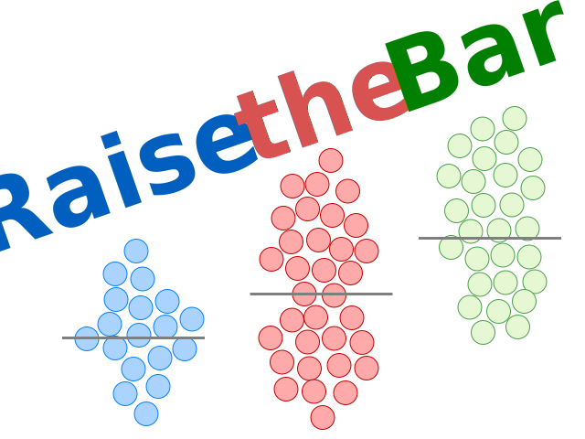

Thanks for visiting our course in Raising the bar: Learning and teaching better data visualization in R.
 
This website was built for the 2022 ESA/CSEE Workshop in Montreal, Canada.

Binder container link here: 

Our website is based on Ines Montani's framework [course-starter-r](https://course-starter-r.netlify.app/) which relies on [Gatsby](http://gatsbyjs.org/) and [Reveal.js](https://revealjs.com) for the client side and [Binder](https://mybinder.org) for running code. We also wrote this workshop with inspiration from some phenomenal examples, like [GAMs in R](https://noamross.github.io/gams-in-r-course) and [R-Bootcamp](https://r-bootcamp.netlify.app/).
